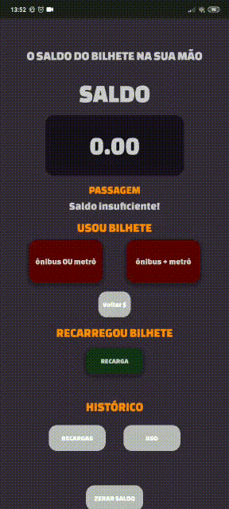

# Saldo Onibus

### ✨ Sobre
Web app que monitora saldo do bilhete único.

https://saldobusao.netlify.app/

## 🔨 Ferramentas
- HTML
- CSS / SASS
- Component / SweetAlert
- Vanilla JS 
- LocalStorage
- PWA
---

## ❤️ Versão
- v3.2 - Adiçao do limpar histórido de uso.
- v3.1 - Adição do histórico de uso.
- v3.0 - Código refatorado.
- v2.8 - Liberar o 'voltar' para ser usado depois, guardando valores em cache.
- v2.7.2 - Corrigindo o valor que aparece, arredondando para baixo.
- v2.7.1 - Ajustando problema getMonth.
- v2.7 - Adicinado confirm ao usar bilhete.
- v2.6 - Corrigido ordem de salvar e exibir recargas.
- v2.5 - Melhorias na lógica do botão voltar, apagando do cache última recarga apagada.
- v2 - Adição do histórico e melhoria na opções.
- v1 - Versão simples com recarga e uso.
---

## 🔥 Adição futura
- *Opção de adicionar o próprio o valor de ônibus de sua cidade.*
- *Adição de data e hora que foi usado o bilhete para melhor controle*

---
## 🥰 Preview v3.1

